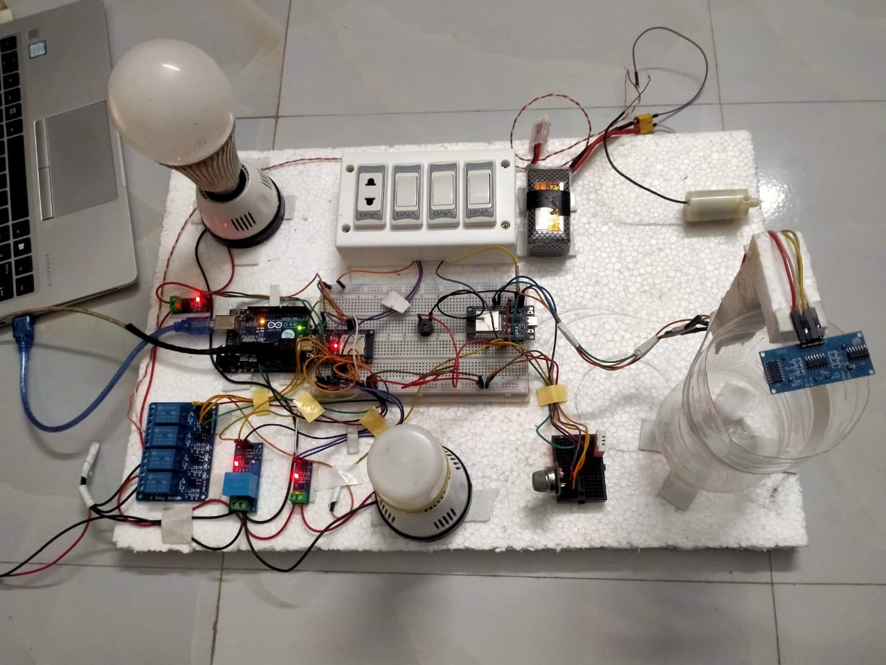
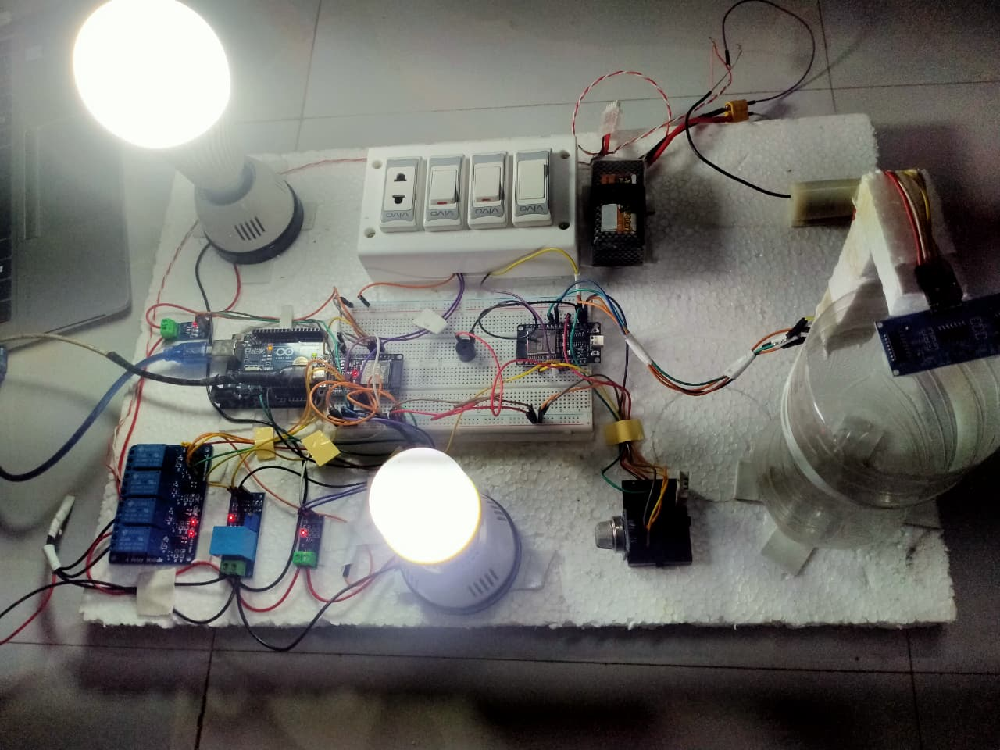

# IoT-Based Home Automation and Energy Monitoring System

## 1. Project Overview

This repository contains the **complete end-to-end implementation** of a smart home automation and energy monitoring system using **ESP32** and **Firebase Realtime Database**. The system measures real-time electrical parameters (voltage, current, power, and energy), controls electrical loads, synchronizes data with the cloud, and visualizes everything through a **web-based dashboard**.

The project is designed in a **modular and professional manner**, where:

- Sensor calibration and validation are handled separately
- Final deployable firmware is isolated
- Cloud and dashboard layers are decoupled from hardware

Anyone following this documentation step-by-step can fully reproduce the system.

---

## 2. System Architecture (High-Level)

```
AC Loads & Sensors
        ↓
     ESP32
        ↓
Firebase Realtime Database
        ↓
Web Dashboard (Netlify)
```

- ESP32 acts as the central measurement and control unit
- Firebase is used as the real-time cloud backend
- The dashboard is a separate web application that reads/writes Firebase data

---

## 3. Repository Structure

```
IoT-Based-Home-Automation-and-Energy-Monitoring-System/
│
├── Final_Overall/
│   ├── Final Overall.ino
│   └── final_overall_project_readme.md
│
├── Firebase_Nodes/
│   ├── ESP1.ino
│   ├── ESP2.ino
│   └── esp_32_firebase_system_readme.md
│
├── Calibration_and_Testing/
│   ├── Test_Current_code.ino
│   ├── Test_Vlotage_code.ino
│   ├── Test_Energy_Code.ino
│   └── calibration_and_testing_readme.md
│
├── Hardware_Setup/
│   ├── OFF.jpg
│   └── ON.jpg
│
└── README.md   (this file)
```

Each folder is explained in detail below.

---

## 4. Folder-wise Explanation and Linked Documentation

### 4.1 Final_Overall (Main Deployable System)

This folder contains the **final integrated firmware** that should be used for demonstrations, evaluation, and real deployment.

- `Final Overall.ino`  
  Final ESP32 firmware integrating:
  - Voltage sensing
  - Current sensing (dual load)
  - Power and energy calculation
  - Monthly energy and bill logic
  - Firebase communication

- `final_overall_project_readme.md`  
  Detailed explanation of:
  - Pin configuration
  - Sensor calibration logic
  - Energy and billing algorithm
  - Cloud communication design

This is the **primary reference** for understanding the complete working system.

---

### 4.2 Firebase_Nodes (Cloud-Oriented Architecture)

This folder documents the **Firebase-based modular architecture**.

- `ESP1.ino`  
  Sensor data publisher node (ESP → Firebase)

- `ESP2.ino`  
  Optional control/monitoring node (Firebase → ESP)

- `esp_32_firebase_system_readme.md`  
  Explains:
  - Why Firebase is used
  - Data flow between nodes
  - Firebase data structure
  - Library choices and design decisions

This folder shows that the system is **scalable and cloud-decoupled**.

---

### 4.3 Calibration_and_Testing (Accuracy & Validation)

This folder ensures **measurement accuracy and academic correctness**.

- `Test_Current_code.ino`  
  ACS712 current sensor calibration and validation

- `Test_Vlotage_code.ino`  
  ZMPT101B voltage sensor calibration

- `Test_Energy_Code.ino`  
  Independent verification of power and energy calculation logic

- `calibration_and_testing_readme.md`  
  Complete methodology for:
  - Offset calculation
  - RMS measurement
  - Scaling factor derivation

These files justify that the final readings are reliable and tested.

---

### 4.4 Hardware_Setup (Real Hardware Proof)

This folder contains real hardware images of the working system.

#### System OFF State



#### System ON State



These images confirm that the project is implemented on real hardware, not simulation only.

---

## 5. Hardware Components Required

### Core Components

- ESP32 Dev Module
- ACS712 Current Sensor (30A) × 2
- ZMPT101B Voltage Sensor
- Relay Module (2-channel or more)
- AC loads (bulb / resistive load)

### Supporting Components

- Breadboard
- Jumper wires
- Manual switches
- AC socket board
- Proper insulated AC wiring

---

## 6. Software, Tools, and Platforms Used

### Firmware & Development

- Arduino IDE
- ESP32 board package
- C / C++ (Arduino framework)

### Cloud Backend

- Firebase Realtime Database
- Firebase Authentication (Email/Password)

Firebase was chosen instead of ThingSpeak because:

- Firebase supports true real-time updates
- Bidirectional data flow (read + write)
- Lower latency, suitable for live dashboard control

### Web Dashboard

- HTML, CSS, JavaScript
- Firebase Web SDK
- Chart-based data visualization

### Deployment

- Netlify (for hosting the web dashboard)

---

## 7. Web Dashboard (Separate Repository)

The web dashboard is maintained as a **separate repository** and connects to the same Firebase database.

### Dashboard Repository

https://github.com/Masud744/smart-home-dashboard

### Live Dashboard

https://masudhome.netlify.app

### Demo Login Credentials

- Email: masud.nil74@gmail.com
- Password: 123456

The dashboard provides:

- Real-time data visualization
- Energy and load status monitoring
- Remote control via Firebase

---

## 8. Step-by-Step Setup Guide (Summary)

1. Assemble hardware as described in the hardware section
2. Perform sensor calibration using files in `Calibration_and_Testing`
3. Upload `Final Overall.ino` to ESP32
4. Create Firebase project and Realtime Database
5. Configure Firebase credentials in firmware and dashboard
6. Power the system and verify live data updates
7. Access dashboard via Netlify link

Each step is explained in detail inside the linked README files.

---

## 9. Demo Video

A demonstration video of the complete system will be provided here:

- YouTube Demo Link: _(to be added)_

---

## 10. Final Notes

- This repository is the **main reference point** for the entire project
- All other README files are linked and organized for easy navigation
- No code modification is required to understand or reproduce the system

This documentation is intentionally detailed to ensure clarity, reproducibility, and professional presentation.

## Author

**Shahriar Alom Masud**  
B.Sc. Engg. in IoT & Robotics Engineering  
University of Frontier Technology, Bangladesh  
📧 Email: shahriar0002@std.uftb.ac.bd  
🔗 LinkedIn: https://www.linkedin.com/in/shahriar-alom-masud

## License

This project is intended for educational and demonstration purposes.
